# Efishery Task Explanation UI

The aplication have four screen main
1. List Screen
2. Filter Screen
3. Add Data Screen
4. Edit Data Screen

| Screen name             | Explanation screen      | image                               |
| ----------------------- | ----------------------- | ----------------------------------- |
| List Screen             | with a design like this the user can see the fish price list when the application is first opened. On this screen there are several actions: 1. search options based on data type 2. searching by keyword 3. move to filter screen 4. add fish price data 5. edit/delete fish price data. with a design like this the display will look simpler but still have enough features to support its users | 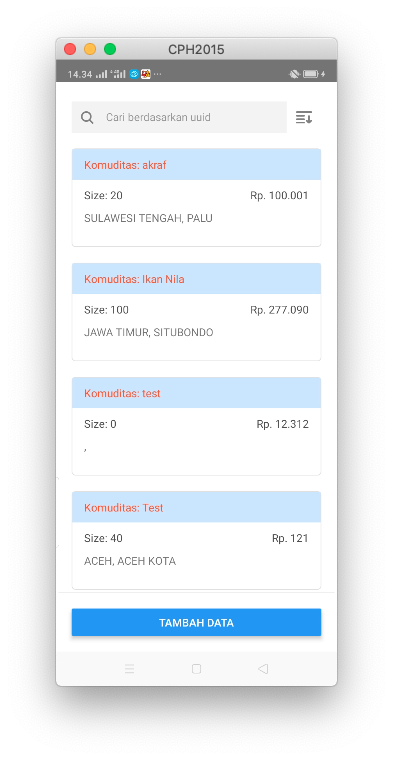 |
| Filter Screen           | This screen is separated from the main screen (list screen) because the filter screen has a broad task and in the future it can have a lot of logic | 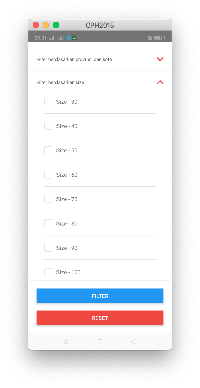 |
| Add Data Scre           | The `add data screen` is separated because it has different tasks from other screens and in the future it will have many types of input such as autocomplate, radio button or checkbox | 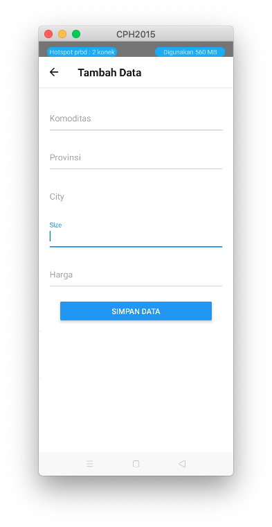 |
| Edit Data Screen        | on this screen it has the same appearance as `add data screen` but this screen is UI separated from other screens because it has a different task but this screen uses the same code as adding a data screen | 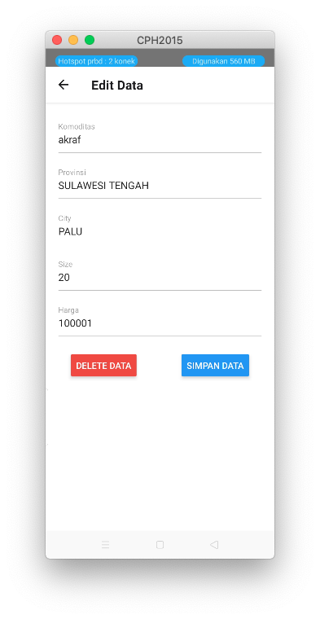 |

## Reference
| Action name             | image                               |
| ----------------------- | ----------------------------------- |
| Search Area | 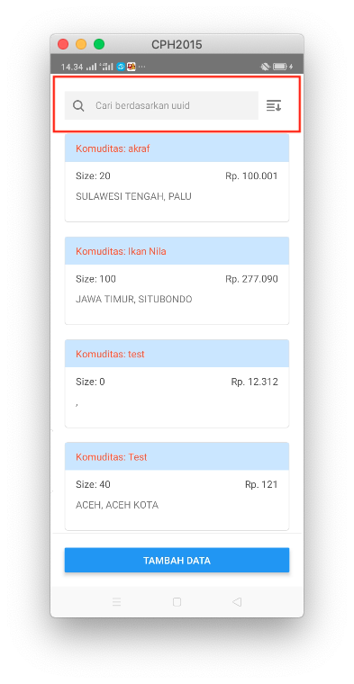 |
| List Fish Price Area | 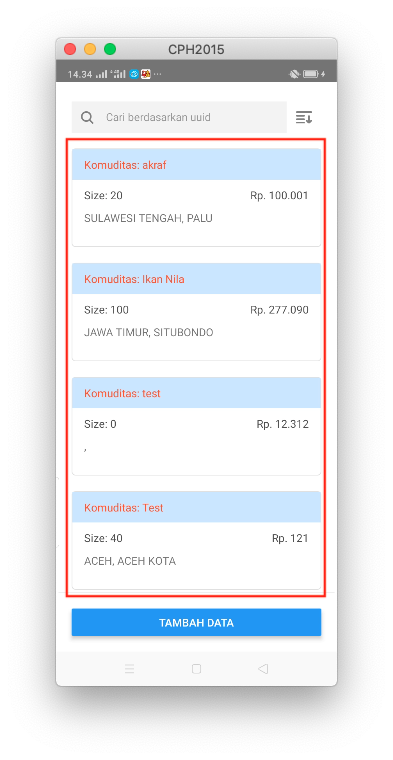 |
| Button Add Data | 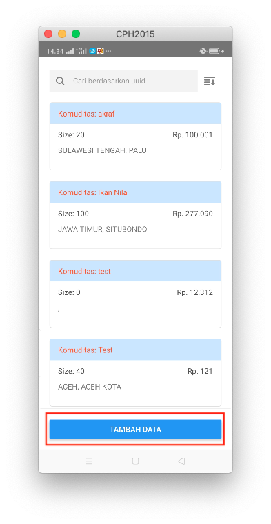 |
| Icon Change Filter By Data | 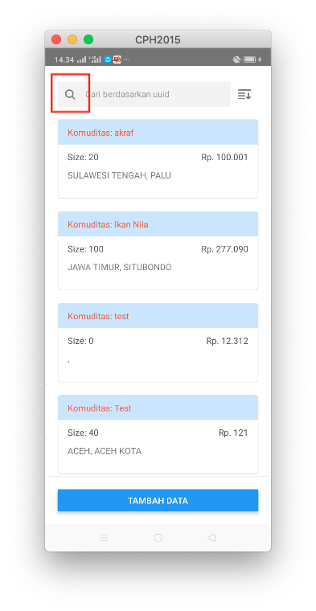 |
| Type Search Data | 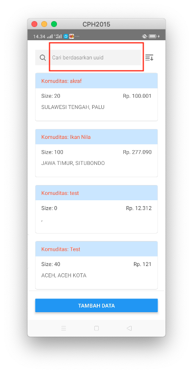 |
| Icon Selected Filter | 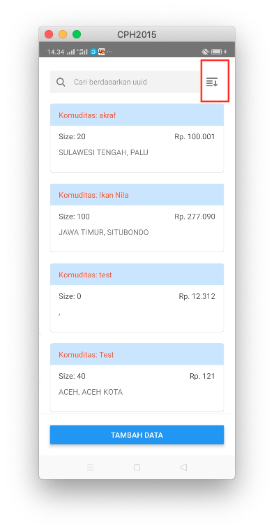 |
| Item for edit/delete data | 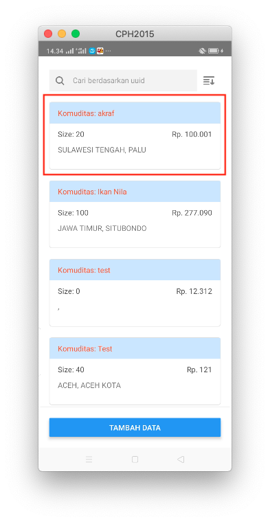 |

## Video Demo
Look vidoe demo this link https://icomoon.io/
